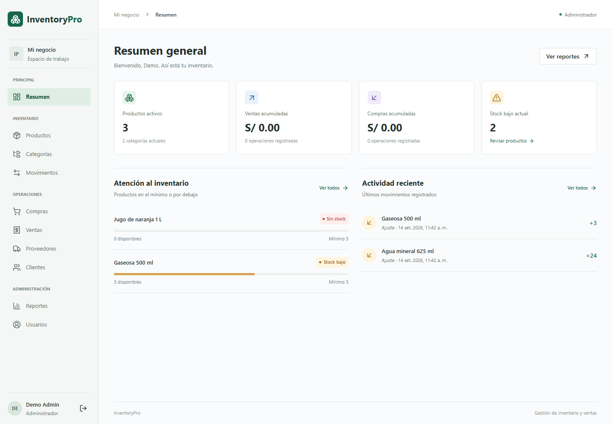

# InventoryPro

Aplicación de inventario, compras y ventas con control de acceso por roles, movimientos auditados y una interfaz adaptable a escritorio y móvil.

**Backend:** Express 5, TypeScript, Prisma 6 y PostgreSQL 16. **Frontend:** React 19, TypeScript, Vite, Tailwind 4, TanStack Query, React Router, Radix Dialog, Lucide y Sonner.



## Funcionalidades

- Acceso con JWT, usuarios activos, permisos por rol y revocación de tokens al cambiar credenciales, rol o estado.
- Gestión de productos, categorías, proveedores, clientes y usuarios; búsqueda y paginación en el servidor.
- Compras y ventas con múltiples productos, importes decimales exactos y revisión antes de confirmar.
- Actualización de stock y movimientos dentro de una misma transacción, con protección frente a ventas concurrentes.
- Ajustes justificados, historial, alertas de stock bajo y reportes por fechas.
- Estados de carga, error y lista vacía; diálogos con control de foco; navegación móvil; exportación CSV.

## Ejecución local

Requisitos: Node.js 24 LTS recomendado, npm y PostgreSQL 16. No se necesita una base de datos alojada para desarrollar.

Desde la raíz del repositorio, instala ambas aplicaciones:

```powershell
npm --prefix backend ci
npm --prefix frontend ci
Copy-Item backend/.env.example backend/.env
```

Crea una base PostgreSQL llamada `inventory_pro` y configura `DATABASE_URL` y `JWT_SECRET` en `backend/.env`. Después:

```powershell
npm --prefix backend run prisma:generate
npm --prefix backend run prisma:deploy
npm --prefix backend run prisma:seed
```

En una terminal ejecuta `npm run dev:backend`; en otra, `npm run dev:frontend`.

- Aplicación: [http://localhost:5173](http://localhost:5173)
- API: [http://localhost:4000/api/health](http://localhost:4000/api/health)
- Cuenta **solo de demostración**: `admin@inventorypro.com` / `Admin123*`. Se crea si no existe; repetir el seed no restablece su contraseña.

## Roles

| Operación                                 | ADMIN | WAREHOUSE | SELLER |
| ----------------------------------------- | :---: | :-------: | :----: |
| Consultar productos y categorías          |  Sí   |    Sí     |   Sí   |
| Crear/editar productos y categorías       |  Sí   |    Sí     |   No   |
| Gestionar proveedores y compras           |  Sí   |    Sí     |   No   |
| Crear/editar clientes                     |  Sí   |    Sí     |   Sí   |
| Registrar/consultar ventas                |  Sí   |    No     |   Sí   |
| Ajustes, movimientos y reportes           |  Sí   |    Sí     |   No   |
| Desactivar registros y gestionar usuarios |  Sí   |    No     |   No   |

Las bajas están sujetas a reglas de integridad; no se borran transacciones históricas.

## Calidad

```powershell
npm run build
npm run test:backend
cd frontend
npx playwright install chromium
npm test
```

Las suites de backend y navegador usan una base separada `inventory_pro_test` y deben ejecutarse en secuencia. GitHub Actions incluye compilación, formato, pruebas y auditoría de dependencias. [Consulta el alcance y resultados de verificación](docs/VERIFICATION.md).

## Documentación

- [Empieza aquí: mapa de documentación por nivel](docs/README.md)
- [Primer recorrido: instalación, ejercicio y diagnóstico](docs/GETTING_STARTED.md)
- [Backend: instalación, configuración y reglas](backend/README.md)
- [Frontend: estructura, sesión y consultas](frontend/README.md)
- [Arquitectura y recorrido de una venta, explicado paso a paso](docs/ARCHITECTURE.md)
- [API: rutas, permisos, cuerpos y errores](docs/API.md)
- [Especificación OpenAPI importable](docs/openapi.json)
- [Validaciones, notificaciones y ejemplo completo](docs/VALIDATION_AND_FEEDBACK.md)
- [Seguridad y límites de confianza](docs/SECURITY.md)
- [Cómo contribuir y añadir funcionalidades](CONTRIBUTING.md)
- [Pruebas](docs/TESTING.md) y [despliegue](docs/DEPLOYMENT.md)

El alcance es un MVP de inventario de un negocio y una moneda (PEN). No incluye facturación electrónica, impuestos, devoluciones, múltiples almacenes ni una publicación en producción. Las limitaciones y decisiones están documentadas para que el proyecto se pueda evaluar y ampliar con claridad.
