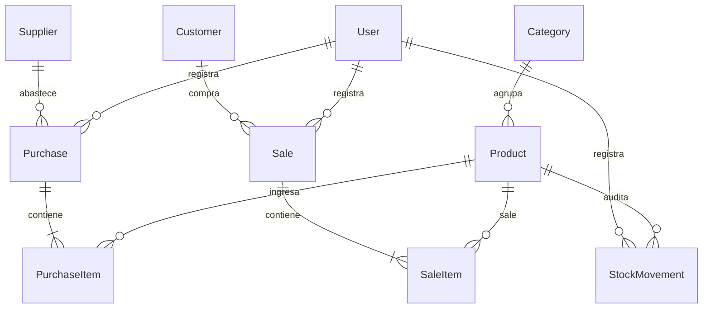

# Arquitectura y guía de aprendizaje

InventoryPro usa una API REST separada del cliente web. Ambas aplicaciones están escritas en TypeScript. PostgreSQL es la fuente de verdad del inventario; el navegador presenta información y envía comandos.

## Recorrido de una petición

```mermaid
flowchart LR
  Form[Formulario React] --> HTTP[lib/api.ts]
  HTTP --> Router[Ruta Express]
  Router --> Auth[Autenticación y permisos]
  Auth --> Controller[Controller HTTP]
  Controller --> Schema[Validación Zod]
  Schema --> Service[Servicio del módulo]
  Service --> DB[(PostgreSQL / Prisma)]
  DB --> Response[Respuesta JSON]
  Response --> Cache[Invalidación de consultas]
  Cache --> UI[Tabla y stock actualizados]
```

Por ejemplo, `POST /api/auth/login` se compone de tres partes: `app.ts` monta `/api`, el router principal monta `/auth`, y `auth.routes.ts` declara `/login`. No necesitas una carpeta para cada segmento de la URL.

## Responsabilidades

| Pieza                       | Qué hace                                          | Qué no necesita conocer                |
| --------------------------- | ------------------------------------------------- | -------------------------------------- |
| Routes                      | Asocia URL, verbo y permisos                      | Cálculo del total de una compra        |
| Middleware de autenticación | Verifica token y usuario activo                   | Campos del formulario de productos     |
| Schema                      | Define datos válidos y transforma valores         | Cómo dibujar un campo en React         |
| Controller                  | Recibe HTTP, valida, llama al servicio y responde | Detalles de una transacción de stock   |
| Service                     | Ejecuta reglas y consultas                        | Estado visual de un modal              |
| Prisma                      | Mapea modelos y ejecuta consultas/transacciones   | Qué menú muestra cada usuario          |
| Query / Mutation            | Obtiene datos o solicita cambios desde React      | Decisiones definitivas de autorización |

Se conserva una arquitectura modular por funcionalidad. No se añade una capa de repositorios que solo envuelva llamadas a Prisma ni controladores universales difíciles de seguir. Se comparten mecanismos concretos: paginación, transacciones con reintento, validaciones comunes, tablas y diálogos.

## Tecnologías y motivos

| Tecnología              | Uso concreto en este repositorio                         | Límite importante                                                                          |
| ----------------------- | -------------------------------------------------------- | ------------------------------------------------------------------------------------------ |
| TypeScript              | Tipos en ambas aplicaciones y tipos inferidos de schemas | Los tipos desaparecen al ejecutar; no validan un JSON recibido                             |
| Express 5               | API HTTP modular y cadena de middleware                  | No decide por sí mismo permisos ni reglas de negocio                                       |
| Zod                     | Valida `body`, `params` y `query` en los controladores   | No reemplaza restricciones de la base ni una transacción                                   |
| Prisma 6                | Cliente tipado, migraciones, relaciones y `Decimal`      | Un ORM no elimina la necesidad de diseñar índices y medir consultas                        |
| PostgreSQL              | Persistencia relacional y transacciones serializables    | No contiene todas las reglas de Zod; escribir SQL directo puede saltárselas                |
| JWT + bcryptjs          | Token firmado y hash de contraseñas                      | El token no cifra su contenido; el hash no se devuelve al cliente                          |
| React 19 + Router       | Componentes, formularios y navegación SPA por rol        | Ocultar un botón no constituye autorización                                                |
| TanStack Query          | Caché del estado remoto, consultas y mutaciones          | No reemplaza la fuente de verdad del servidor                                              |
| Vite + Tailwind 4 + CSS | Desarrollo, compilación y estilos compartidos            | El servidor de desarrollo no debe usarse para producción                                   |
| Radix Dialog + Lucide   | Diálogos con gestión de foco e iconos comunes            | El contenido y el comportamiento específico siguen siendo responsabilidad de la aplicación |
| Sonner                  | Un único sistema de avisos transitorios                  | Los errores de campo conservan su contexto junto al formulario                             |
| Node test + Playwright  | Integración API y recorridos reales del navegador        | Una suite aprobada no demuestra ausencia absoluta de defectos                              |

Las versiones exactas instaladas están fijadas en los `package-lock.json` de cada aplicación. El backend y el frontend tienen paquetes independientes, no un npm workspace. Comparten el lenguaje y el contrato HTTP, pero no importan sus archivos de implementación entre sí.

## Mapa del código

| Ruta                             | Responsabilidad y punto de entrada                                              |
| -------------------------------- | ------------------------------------------------------------------------------- |
| `backend/src/server.ts`          | Arranque del proceso, puerto y cierre de recursos                               |
| `backend/src/app.ts`             | Middleware global, montaje `/api`, 404 y errores                                |
| `backend/src/routes/index.ts`    | Montaje de routers por recurso                                                  |
| `backend/src/config/`            | Configuración de entorno y cliente Prisma                                       |
| `backend/src/middlewares/`       | Autenticación, autorización y traducción de errores a HTTP                      |
| `backend/src/modules/<recurso>/` | Routes, controller, schema y service del recurso                                |
| `backend/src/utils/`             | Mecanismos compartidos: paginación, validación, JWT, contraseña y transacciones |
| `backend/prisma/`                | Modelo, historial de migraciones y seed de demostración                         |
| `backend/tests/`                 | Preparación de base aislada y pruebas de integración                            |
| `frontend/src/main.tsx`          | Proveedores de React, límite de errores y Toaster global                        |
| `frontend/src/app/`              | Rutas, layout y acceso a páginas                                                |
| `frontend/src/features/`         | Páginas y formularios por dominio                                               |
| `frontend/src/components/`       | Tablas, selectores y diálogos reutilizables                                     |
| `frontend/src/lib/`              | HTTP, tipos de respuestas y presentación de valores                             |
| `frontend/tests/`                | Escenarios Playwright de escritorio y móvil                                     |
| `.github/workflows/ci.yml`       | Comprobaciones automatizadas con PostgreSQL de prueba                           |

`dist/`, `node_modules/` y los resultados temporales de las pruebas son generados. No se editan a mano ni deben añadirse al repositorio.

## Estado del navegador

El estado local de React contiene el formulario abierto, sus campos, selección de productos y confirmación pendiente. TanStack Query conserva el estado remoto de listas y reportes. El token está en memoria y `sessionStorage`, y `AuthProvider` restaura la identidad consultando `/auth/me`.

Una consulta tiene clave formada por recurso y filtros; al cambiar búsqueda o página se consulta la combinación correspondiente. Se espera 300 ms al buscar y se abortan lecturas canceladas. Después de una escritura se invalidan las consultas para que las pantallas relacionadas vuelvan a consultar. Es una estrategia conservadora y fácil de mantener; con más tráfico se mediría antes de hacer invalidaciones más específicas.

No hay actualización optimista de stock: la interfaz espera al servidor. Tampoco hay reintentos automáticos de escrituras HTTP. El reintento serializable del backend ocurre dentro de una única operación y no equivale a repetir una venta desde el navegador.

## Ejemplo: una venta

1. El vendedor selecciona productos. El frontend propone el precio de catálogo y muestra cantidad, stock y subtotal.
2. Revisa el resumen y confirma. Se envían IDs, cantidades y precios unitarios; no se confía en un total calculado por el navegador.
3. Zod rechaza cantidades inválidas, precios con más de dos decimales, listas vacías y productos repetidos.
4. El servicio abre una transacción `Serializable`, comprueba el cliente opcional y los productos activos, y verifica el stock.
5. Calcula importes con `Prisma.Decimal`, guarda venta y líneas, descuenta existencias y registra movimientos.
6. Si una operación falla, se revierte la transacción completa. Si otro proceso cambió el stock, se reintenta toda la transacción, incluida su validación.
7. Al confirmar, React invalida consultas. Productos, historial y resumen volverán a leer la información del servidor.

Con stock 10, dos ventas simultáneas de 7 no pueden confirmar ambas. La prueba automatizada comprueba que una devuelva 201, la otra 409 y el stock final sea 3.

## Modelo de datos

Un producto tiene una categoría, y una categoría puede tener muchos productos. El orden de declaración de los modelos no crea la relación; lo hacen `categoryId`, `@relation` y la clave foránea de la base. Para insertar un producto sí debe existir la categoría referenciada.

`Purchase` y `Sale` son cabeceras: guardan responsable, contacto, fecha y total. `PurchaseItem` y `SaleItem` contienen una línea por producto con su cantidad, precio de ese momento y subtotal. Por eso un cambio posterior del precio del catálogo no modifica los importes históricos. Los nombres de productos/contactos se consultan mediante relaciones y sí pueden reflejar renombrados posteriores: no existe una instantánea completa de todos los datos descriptivos.

`StockMovement` registra producto, responsable, tipo y stock anterior/nuevo. La referencia a una compra o venta se escribe actualmente en `reason`; no hay una clave foránea dedicada de movimiento a documento. Es trazabilidad de inventario, no un libro contable inmutable frente a un administrador de base de datos.

- `String`: tipo del campo; un ID UUID se representa como texto en Prisma y JSON.
- `@id`: clave primaria que identifica una fila.
- `@default(uuid())`: genera un identificador para una fila nueva.
- `@unique`: evita duplicados en un campo, como email o SKU, incluso con peticiones simultáneas.
- `createdAt` y `@default(now())`: fecha de creación.
- `updatedAt` y `@updatedAt`: última actualización del registro por Prisma.
- `Decimal(10,2)`: decimal exacto con dos posiciones decimales. Prisma lo serializa como cadena JSON para no perder precisión.
- `@@index`: ayuda a resolver filtros, relaciones y ordenaciones habituales. Un índice no hace instantánea cualquier búsqueda; `contains` sobre texto puede necesitar otras estrategias a gran escala.

## Decisiones y límites

- Una sola moneda de presentación, PEN. No hay impuestos, facturación electrónica ni conversión de monedas.
- Compras y ventas no se editan ni se eliminan. Devoluciones, anulaciones y reservas de stock quedan fuera de esta versión.
- Los reportes muestran ventas/compras del período, inventario actual y hasta diez movimientos recientes. Compras no equivale a costo de mercadería vendida; su diferencia con ventas no es una utilidad contable.
- Paginación por desplazamiento con máximo 100 registros. Es adecuada para el alcance actual; ante millones de registros se medirían consultas y se evaluaría paginación por cursor/búsqueda especializada.
- JWT Bearer con revocación por versión del usuario. No hay MFA, recuperación de contraseña ni refresh tokens.
- Una petición de compra/venta repetida manualmente crea otra operación. No hay clave de idempotencia para recuperarse automáticamente de una respuesta perdida; ante un fallo de red se debe revisar el historial antes de repetir.

## Para estudiar el proyecto

Comienza por `categories`: sigue su ruta, controlador, schema y servicio. Luego revisa `products` para entender la relación. Después pasa a `sales` y su prueba concurrente. En React, lee `CatalogPage`, `CatalogForm` y `lib/api.ts` en ese orden. Los nombres de carpetas coinciden con las responsabilidades descritas arriba.

Para seguir una venta en archivos reales: [TransactionForm](../frontend/src/features/transactions/TransactionForm.tsx) → [api](../frontend/src/lib/api.ts) → [sale.routes](../backend/src/modules/sales/sale.routes.ts) → [sale.controller](../backend/src/modules/sales/sale.controller.ts) → [sale.schema](../backend/src/modules/sales/sale.schema.ts) → [sale.service](../backend/src/modules/sales/sale.service.ts) → [serializable](../backend/src/utils/transaction.ts). El controller ejecuta el schema: no hay un middleware de validación independiente en esas rutas.
