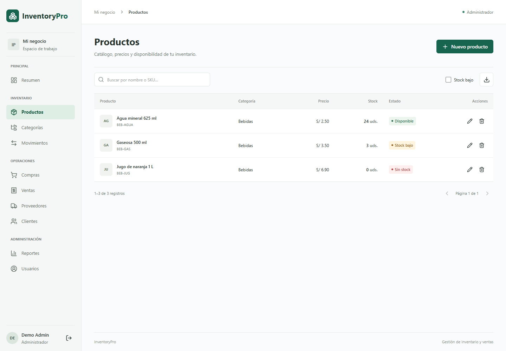

# Verificación de la entrega

Fecha: 2026-09-14. Entorno local: Windows, Node.js 24.16, PostgreSQL 16 y Chrome automatizado con Playwright. Estas comprobaciones corresponden al código de esta entrega, no garantizan resultados de futuras modificaciones.

| Comprobación                               | Resultado                                                  |
| ------------------------------------------ | ---------------------------------------------------------- |
| Compilación de backend y frontend          | Correcta                                                   |
| Suite de integración de API                | 12 pruebas aprobadas                                       |
| Suite de navegador                         | 16 pruebas aprobadas: 8 en escritorio y 8 en móvil         |
| Formato Prettier                           | Correcto                                                   |
| `git diff --check`                         | Sin errores de espacios                                    |
| `npm audit --omit=dev`, backend            | 0 vulnerabilidades reportadas                              |
| `npm audit --omit=dev`, frontend           | 0 vulnerabilidades reportadas                              |
| OpenAPI JSON y referencias internas        | 21 rutas, 38 operaciones; referencias resueltas            |
| Enlaces locales de documentación           | 13 documentos comprobados; sin destinos inexistentes       |
| Migración de índices y `tokenVersion`      | Aplicada a la base local sin eliminar datos                |
| Acceso desde el frontend a la API habitual | Health 200, login ADMIN, perfil y lista paginada correctos |

## Escenarios comprobados

Autenticación sin token, token inválido, credenciales incorrectas, permisos de los tres roles, límite de intentos, usuarios desactivados y revocación al cambiar contraseña. Las ediciones parciales conservan campos omitidos y el administrador no puede desactivar su propia cuenta ni cambiar su rol.

Una compra calcula importes exactos y actualiza el stock junto con su movimiento. Dos ventas simultáneas que excederían juntas el inventario dan 201 y 409, respectivamente, sin stock negativo ni registros parciales. Se verificaron ajustes con diferencias firmadas, rechazo de ajustes sin cambio, bajas con relaciones y preservación del historial.

En el navegador se probaron acceso y recarga de sesión, CRUD de categorías, alta de producto, ajuste de stock, edición del perfil, permisos del vendedor, sesión inválida, compra y venta con revisión previa, tablas y navegación. Se comprobó que la página no tenga desbordamiento horizontal en los tamaños usados; las tablas tienen su propio desplazamiento. Se inspeccionaron capturas del dashboard, productos y formulario de compra en móvil/escritorio.

La revisión de formularios añade teléfonos nacionales de 9 dígitos en clientes y proveedores, rechazo de letras/pegados inválidos, nombres compuestos solo por espacios y preservación de datos tras rechazos de la API. Se verificaron las cinco confirmaciones (categorías, productos, proveedores, clientes y usuarios), foco en Cancelar, cierre con Escape, dimensiones compactas y ausencia de separadores duplicados. Sonner sustituye los avisos transitorios: se probaron expiración, cierre manual y cierre de un error con el diálogo todavía abierto. Los errores de campo permanecen asociados al control.

La primera ejecución detectó que el texto de validación se incorporaba al nombre accesible del campo. Se corrigió la identificación del input y se repitió la suite completa: 16/16 aprobadas. La compilación y las 12 pruebas del backend se volvieron a ejecutar después de los cambios.

Las pruebas usan `inventory_pro_test`. La comprobación final sobre `inventory_pro` solo inició sesión y consultó datos; no añadió ventas, compras ni ajustes al inventario del usuario.

## Evidencia visual

Las capturas usan datos de prueba, no información privada del negocio.

[Dashboard móvil](screenshots/mobile.png)

[Confirmación compacta en escritorio](screenshots/confirmation-desktop.png) · [Confirmación móvil](screenshots/confirmation-mobile.png) · [Formulario con borde único](screenshots/contact-form.png)

## Límites de la verificación

El workflow de GitHub Actions quedó configurado, pero no se ejecutó en GitHub desde esta sesión. No se realizó despliegue público, prueba de carga, auditoría externa de seguridad ni auditoría completa de accesibilidad con tecnologías asistivas. Los controles de sesión y los límites funcionales están explicados en [Arquitectura](ARCHITECTURE.md) y [Despliegue](DEPLOYMENT.md).

Las comprobaciones no cubren todas las combinaciones posibles de navegador, red, volumen y datos. Las capturas y pruebas documentadas son evidencia del alcance descrito, no una garantía de funcionamiento perfecto en cualquier entorno.
